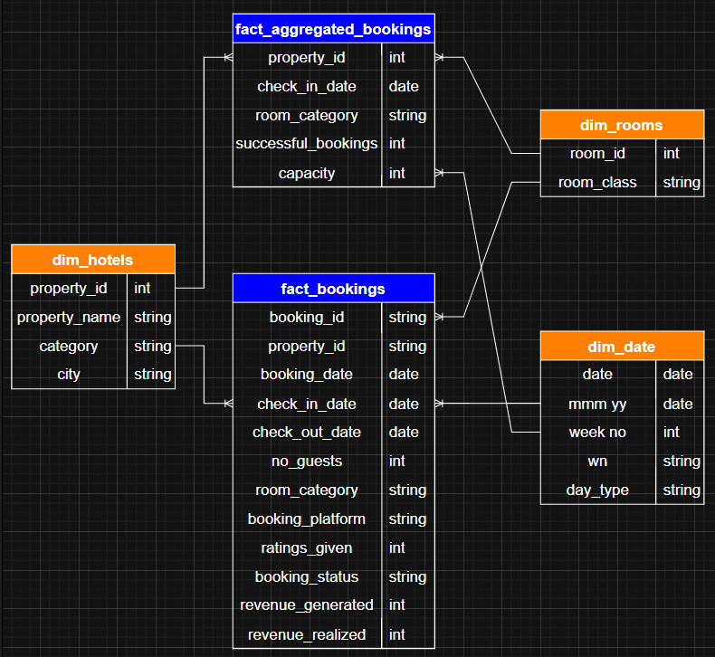

# Project Background

Atliq Group operates in the **hospitality industry**, managing hotel properties across multiple cities, room categories, and booking channels. The business generates revenue through room bookings while monitoring occupancy, pricing, cancellations, and overall property performance.

This project analyzes historical booking and operational data to evaluate hotel performance, identify demand and booking patterns, and uncover opportunities to improve revenue and operational efficiency.

The analysis focuses on key business metrics including **Revenue, Occupancy Rate, Average Daily Rate (ADR), RevPAR, Realization Rate, Bookings, Cancellations, and No-Shows**.

Key areas of analysis include:

- **Revenue & Booking Trends:** Analysis of booking volumes and revenue patterns across properties and time periods.
- **Hotel & Room Performance:** Evaluation of property and room-category performance using occupancy, ADR, and RevPAR.
- **Booking & Cancellation Analysis:** Analysis of booking statuses, cancellations, and no-shows to identify potential revenue leakage.
- **Operational Performance:** Evaluation of occupancy, realization rates, and other operational KPIs to identify performance gaps and improvement opportunities.

The python scripts utilized to clean and quarantine data can be found [here.](data_cleaning/src/quality_pipeline.ipynb)

The python scripts utilized to inspect and perform quality checks can be found [here.](data_cleaning/tests/test_data_quality.py)

The pipeline runner used to automate execution and enforce the data quality gate can be found [here.](data_cleaning/run_pipeline.py)

The automation script used to run the data quality pipeline and execute automated Pytest validations can be found [here.](data_cleaning/run_pipeline.py)

The SQL script used to perform data transformations for analysis can be found [here.](SQL_scripts/transformations.sql)

The SQL queries used to perform the hotel portfolio analysis can be found [here.](SQL_scripts/eda.sql)

# Data Schema and Structure

