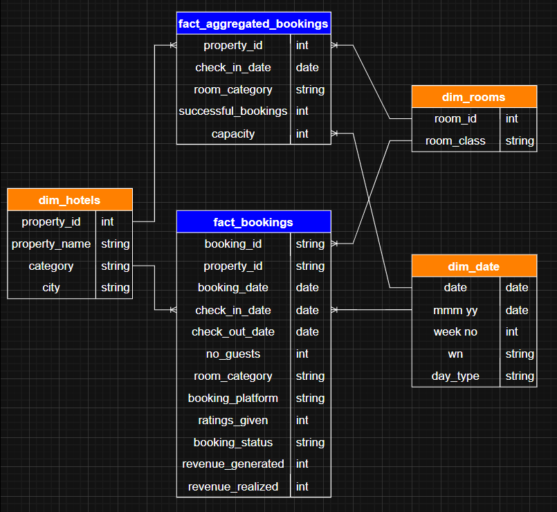
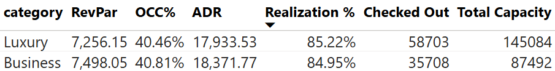
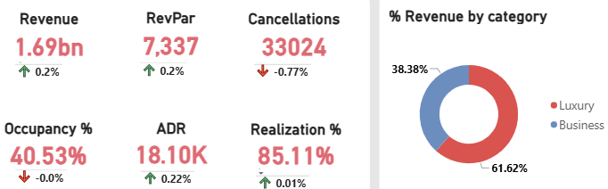
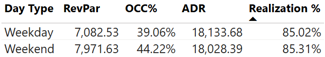
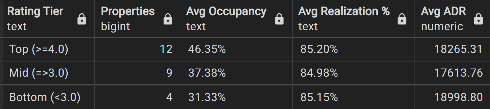
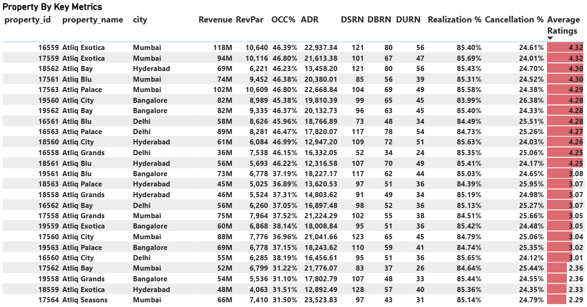
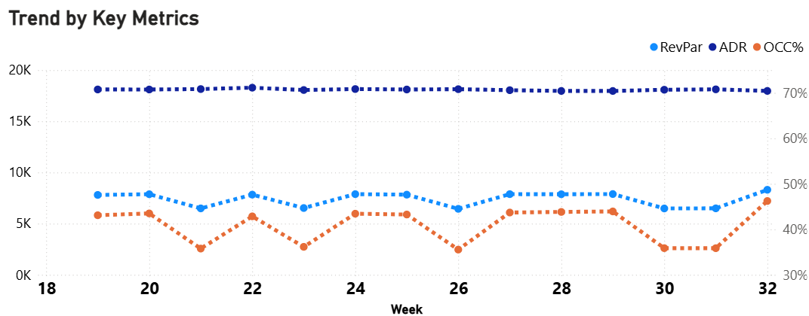
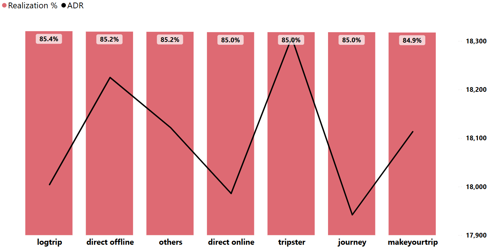

# Project Background

Atliq Group operates in the **hospitality industry**, managing hotel properties across multiple cities, room categories, and booking channels. The business generates revenue through room bookings while monitoring occupancy, pricing, cancellations, and overall property performance.

This project analyzes historical booking and operational data to evaluate hotel performance, identify demand and booking patterns, and uncover opportunities to improve revenue and operational efficiency.

The analysis focuses on key business metrics including **Revenue, Occupancy Rate, Average Daily Rate (ADR), RevPAR, Realization Rate, Bookings, Cancellations, and No-Shows**.

Key areas of analysis include:

- **Revenue & Booking Trends:** Analysis of booking volumes and revenue patterns across properties and time periods.
- **Hotel & Room Performance:** Evaluation of property and room-category performance using occupancy, ADR, and RevPAR.
- **Booking & Cancellation Analysis:** Analysis of booking statuses, cancellations, and no-shows to identify potential revenue leakage.
- **Operational Performance:** Evaluation of occupancy, realization rates, and other operational KPIs to identify performance gaps and improvement opportunities.

Key metrics and measures for the hotel industry used in this project can be found [here.](metrics_list.xlsx)

The python scripts utilized to clean and quarantine data can be found [here.](data_cleaning/src/quality_pipeline.ipynb)

The python scripts utilized to inspect and perform quality checks can be found [here.](data_cleaning/tests/test_data_quality.py)

The pipeline runner used to automate execution and enforce the data quality gate can be found [here.](data_cleaning/run_pipeline.py)

The automation script used to run the data quality pipeline and execute automated Pytest validations can be found [here.](data_cleaning/run_pipeline.py)

The python script used to connect python to postgres to export cleaned data for analysis can be found [here.](data_cleaning/setup_database.py)

The SQL script used to perform data transformations for analysis can be found [here.](SQL_scripts/transformations.sql)

The SQL queries used to perform the hotel portfolio analysis can be found [here.](SQL_scripts/eda.sql)

To view the full dashboard click [here.](Dashboard.png)

# Data Schema and Structure

The Atliq database follows a Star Schema consisting of 5 tables: 2 fact tables and 3 dimension tables, with a total of 143,911 records.

# Executive Summary

### Overview of Findings

  

Atliq Group of Hotels generated ₹1.69Bn (₹169 crore) in revenue across 3 months, with Luxury properties contributing 61.62% of that total versus 38.38% from Business. This is notable because on a per-room basis, Business actually outperforms Luxury, higher RevPAR (₹7,498 vs. ₹7,256), ADR (₹18,372 vs. ₹17,934), and occupancy (40.81% vs. 40.46%). Luxury's larger revenue share instead comes from scale: it carries 66% more room capacity (145,084 vs. 87,492) and logged 64% more checkouts (58,703 vs. 35,708) than Business over the same period. 

Demand also skews toward weekends: Weekend RevPAR (₹7,971.63) and occupancy (44.22%) both outpace weekdays (₹7,082.53 and 39.06%), even though ADR is nearly identical across the two, meaning the gap comes from more rooms selling on weekends, not from charging more for them.

Together, these patterns point to a portfolio that could grow revenue further by extending weekend-level demand into weekdays, and by improving Business's per-room efficiency into a larger footprint, since Business already outperforms Luxury on RevPAR, ADR, and occupancy but operates at roughly 60% of its capacity.

  

  

### Property Wise Performance

  

* **Guest rating is a strong predictor of occupancy, not of booking integrity.** There's a ~15-point occupancy gap between the top-rated and bottom-rated tiers (46.35% vs. 31.33%), but Realization Rate stays essentially flat across all three tiers (84.98%–85.20%). Low-rated properties aren't losing more revenue to cancellations, they're simply failing to generate demand in the first place, which points to a guest-experience problem rather than an operations or booking-policy one.

* **Pricing doesn't track with rating or occupancy in a straight line.** ADR is lowest in the Mid tier (₹17,613.76) and highest in the Bottom tier (₹18,998.80), meaning the worst-rated, lowest-occupancy properties are charging more than mid-performers, not less. This rules out discounting as the driver of low ratings and instead suggests a price/experience mismatch at the bottom end of the portfolio.

* **The gap is property-specific, not room-category-specific.** The same property appears in both the top and bottom tiers depending on city, e.g., Atliq Bay rates 4.30 in Hyderabad and 4.28 in Bangalore, but only 2.36 in Mumbai, ruling out a portfolio-wide format issue and pointing instead to inconsistent execution at specific city locations.

* **Standout outlier: Atliq Seasons (Mumbai).** This single property carries the highest ADR in the entire portfolio (₹23,523.83) alongside the lowest rating (2.29) and just 31.50% occupancy, the clearest individual case of a pricing/experience mismatch worth flagging for a targeted review.

**Takeaway:** Guest satisfaction, not price or cancellation behavior, is the strongest differentiator of property performance in this portfolio. Since Realization Rate holds steady regardless of rating tier, the recovery lever here isn't pricing or policy, it's guest-experience investment at the specific underperforming city properties (starting with Mumbai and Bangalore's lowest-rated locations), where charging comparable-or-higher rates isn't translating into demand.

  

### Revenue and Occupacy Trends over Weeks

* **ADR is essentially flat across 13 weeks**, a band of roughly ₹17,500–18,500, under a 6% spread. This is a striking level of pricing stability over a 3-month window and suggests the portfolio is running on a static or near-static rate card rather than actively adjusting prices week to week. A hotel practicing dynamic/demand-based pricing would typically show ADR rising in higher-occupancy weeks (e.g., weeks 24 and 28) and falling in low weeks (26, 30), which isn't visible here.

* **Occupancy is the metric actually doing the moving**, swinging between roughly 33% and 47%, a range nearly 3x wider (proportionally) than ADR's. Every visible RevPAR peak and dip lines up with an Occupancy peak or dip (e.g., both dip together around week 26, and both rise together into weeks 27–28), while ADR barely reacts at either point.

* **RevPAR is currently functioning as an occupancy proxy rather than a true revenue-efficiency metric.** With ADR holding nearly constant, week-over-week RevPAR movement is being driven almost entirely by occupancy, meaning a rise in RevPAR reflects more rooms sold, not stronger revenue per room. This distinction matters for reporting: RevPAR should be interpreted alongside its two components rather than as a standalone revenue-quality signal until pricing becomes a more active variable.

* **The hotel's flat pricing is a missed-revenue signal.** Weeks 24 and 28 show occupancy spikes with no corresponding ADR increase, classic conditions where demand-based pricing (charging more when rooms are naturally selling faster) could have captured extra revenue that a flat rate card leaves on the table.

Takeaway: The portfolio's revenue swings are being driven by how many rooms sell, not by what they're priced at. Since ADR isn't responding to visible demand peaks (weeks 24, 28), introducing even basic demand-based pricing — raising rates modestly during high-occupancy weeks, is a low-risk, quantifiable opportunity to capture revenue currently being left on the table.

  

# Recommendations

  

* **Introduce Differential Pricing for Direct Offline Bookings:** With an ADR of **₹18,225** and **85.2%** realization rate, the Direct Offline channel appears to maintain a relatively high price without differentiated offers. Since this channel avoids third-party commissions, targeted lower pricing or exclusive direct-booking offers can be tested to improve occupancy and booking volume while retaining more revenue per booking.

* **Maintain Consistent Public Pricing Across Channels:** Keep the public room price broadly consistent across booking channels rather than creating large price differences that could affect channel competitiveness. Instead of lowering the public price, opt for promotional offers or coupons such as introducing a 5% direct-booking discount. This keeps the advertised price unchanged while providing customers with an incentive to book directly.

* **Introduce Demand Based Pricing** The hotel's ADR remains nearly constant at around ₹18,000 throughout the three-month period, indicating a largely flat pricing strategy. However, weekend demand is higher, with 44.22% occupancy compared with 39.06% occupancy on weekdays, while ADR remains almost unchanged (₹18,028 vs. ₹18,134). The hotel could capture additional revenue by moving beyond flat pricing and adopting either weekday/weekend pricing or a more dynamic pricing strategy that adjusts rates based on demand, occupancy, festive seasons, holidays, and other high-demand periods.